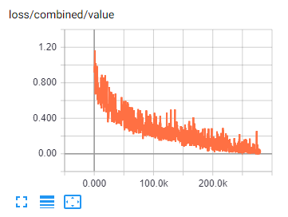
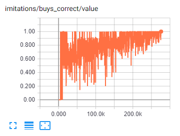
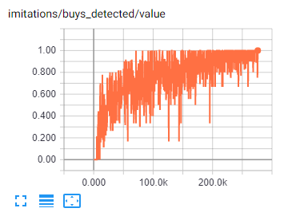
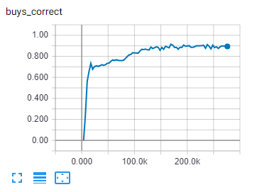
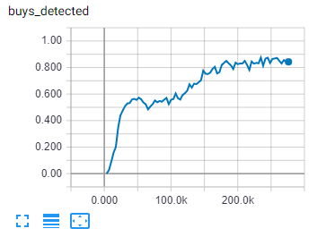

# NAYtrading.AI #
This is the machine learning part of [N.A.Y.trading](/../../).

## :mortar_board: Training a Convolutional Neural Network on the recorded data ##

Install [Python 3.6](https://www.python.org/downloads/release/python-366/). Include PIP if asked by the setup.

If you have an NVIDIA graphics card:
- Install the latest [graphics card driver](https://www.nvidia.com/Download/index.aspx?lang=en-us)
- Install [CUDA Toolkit](https://developer.nvidia.com/cuda-downloads)
- Install [cuDNN](https://developer.nvidia.com/cudnn). Get a cuDNN version that matches your CUDA version number.

Download the sources of [NAYtrading.AI](/NAYtrading.AI) and [NAYtrading.Common](/NAYtrading.Common) or the whole [NAYtrading](/../../) repository. You should now have a folder that contains both the NAYtrading.AI and NAYtrading.Common folders.

Go to your N.A.Y.trading [account page](http://naytrading.com/manage) and download your processed trade decisions as CSV files using the download buttons in the *Export preprocessed training data for artifical intelligence training* section.
Save the files in the NAYtrading.AI folder.

Run [main_buying_train_norm.bat](main_buying_train_norm.bat) or [main_selling_train_norm.bat](main_selling_train_norm.bat) from the NAYtrading.AI folder.

A folder with the name modelXXX will be created where XXX is the current time. Open that folder and run *tensorboard.bat*. Go to [Tensorboard](http://localhost:6006/#scalars&run=log%5Ctrain&_smoothingWeight=0&tagFilter=%5Eloss%24%7C%5Eloss%2Fcombined%7C(buy%7Csell)s_detected%7C(buy%7Csell)s_correct&_ignoreYOutliers=false) to monitor the training progress.

In the top section of Tensorboard it will show three red graphs. 

  

These are the statistics of how well your trained network performs on the training data.
- The graph containing the word *loss* in its title (e.g. *loss/combined/value*) shows a metric about how different the network's current decision making is from the given training data. This will go down over time. 0 meaning that the trained network reproduces all given decisions correctly.
- The graph containing the word *buys_correct* or *sells_correct* in its title (e.g. *imitations/buys_correct/value*) shows a metric about how many buy or sell decisions by the trained network are also buy or sell decisions in your training data. The values range between 0 and 1. 1 meaning that 100% of the network's buy or sell decisions are (presumably) correct.
- The graph containing the word *buys_detected* or *sells_detected* in its title (e.g. *imitations/buys_detected/value*) shows a metric about how many of your buy or sell decisions were also classified as buy or sell by the trained network. The values range between 0 and 1. 1 meaning that 100% of your buy or sell decisions were reproduced by the trained network.

Later, when the first evaluation of the trained model occurs (automatically), three blue graphs will appear. 

  

These are the statistics of how well your trained network performs on unseen data (the evaluation CSV file). You want this to be as good as possible. If your network performs poorly, you need more training data.

The training optimum is reached when the blue loss curve is at its lowest point (at 200.0k in the image above). You need to estimate that by observing Tensorboard regularly throughout the training process. It takes a couple of minutes between updates of the curve, so don't feel rushed. Stop the training process when the blue loss curve stops going down and starts to go horizontally. If you don't stop at that point, the loss on the training data will continue to decrease but the loss on the evaluation data (unseen stock price history) will start to increase. That means, a longer training period does not necessarily yield better results.

Training is a hardware demanding process. If you are using a graphics card, it can still take hours or days to reach the optimum. If you are only using your CPU, good luck ;).

## :moneybag: Using the trained network ##

Once you have a trained network for buying (and preferably another network for selling), you can run client.py to act as a user on N.A.Y.trading using the trained network(s) to decide on snapshots automatically. 

Go to [http://naytrading.com](http://naytrading.com) and register a new account for your AI. A recommended account email address is your real email address followed by *.ai*, e.g. *john.doe@mailbox.com.ai*. That email address doesn't need to actually exist. Consider it an account "name". Using that convention is optional, but it automatically enables some convenient features.


<details>
<summary>How to install on Raspberry PI</summary>

```sh
pi@raspberrypi:~/ $ git clone https://github.com/chrwoizi/naytrading.git
pi@raspberrypi:~/ $ cd naytrading/NAYtrading.AI
pi@raspberrypi:~/naytrading/NAYtrading.AI $ ./install.sh

```

Run client.py with trained buying and selling models:

```sh
# replace %1 with your buying model directory path, e.g. model20180629121604
# replace %2 with your selling model directory path, e.g. model20180703114329
# replace %3 with the number of seconds the AI should wait between snapshots, e.g. 30
python3.4 client.py --buy_checkpoint_dir=%1\\checkpoint --sell_checkpoint_dir=%2\\checkpoint --sleep=%3
```

Having a selling network is optional. If you don't have enough training data yet to achieve a satisfying ratio of sells_correct (see Tensorboard above), you can remove the sell_checkpoint_dir option and use thresholds to make sell decisions.
```sh
# replace %1 with your buying model directory path, e.g. model20180629121604
# replace %2 with the number of seconds the AI should wait between snapshots, e.g. 30
# see client.py for help on the threshold parameters.
python3.4 client.py --buy_checkpoint_dir=%1\\checkpoint --sleep=%2 --min_loss=0.1 --min_gain=0.04 --max_loss=0.3 --max_gain=0.15 --sell_at_max_factor=1
```

</details><p></p>

<details>
<summary>How to install on Windows</summary>

Download Python 3.x from https://www.python.org/downloads/ and run the installer.

Drag your model folder(s) onto client_on_dropped_models.bat or run client.py from the console:

```sh
# replace %1 with your buying model directory path, e.g. model20180629121604
# replace %2 with your selling model directory path, e.g. model20180703114329
# replace %3 with the number of seconds the AI should wait between snapshots, e.g. 30
pip install requests
pip install tensorflow
python client.py --buy_checkpoint_dir=%1\\checkpoint --sell_checkpoint_dir=%2\\checkpoint --sleep=%3
```

Having a selling network is optional. If you don't have enough training data yet to achieve a satisfying ratio of sells_correct (see Tensorboard above), you can remove the sell_checkpoint_dir option and use thresholds to make sell decisions. Drag your buying model directory onto client_on_dropped_models.bat or run client.py from the console:
```sh
# replace %1 with your buying model directory path, e.g. model20180629121604
# replace %2 with the number of seconds the AI should wait between snapshots, e.g. 30
# see client.py for help on the threshold parameters.
pip install requests
pip install tensorflow
python client.py --buy_checkpoint_dir=%1\\checkpoint --sleep=%2 --min_loss=0.1 --min_gain=0.04 --max_loss=0.3 --max_gain=0.15 --sell_at_max_factor=1
```

</details><p></p>

When asked, enter your AI account email address (the one ending on *.ai*) and its password. **Do not** enter your regular N.A.Y.trading account email address (e.g. *john.doe@mailbox.com*) because client.py will decide on snapshots using the given account and you probably don't want your real decisions mixed with the network's decisions.

You can continue deciding on snapshots with your regular account and, from time to time, log in as your AI account to check its performance using the [Stats page](http://naytrading.com/app/#!/stats). If you used the naming convention .ai, as mentioned above, you can switch between accounts using the selection box on the top of the stats page.
