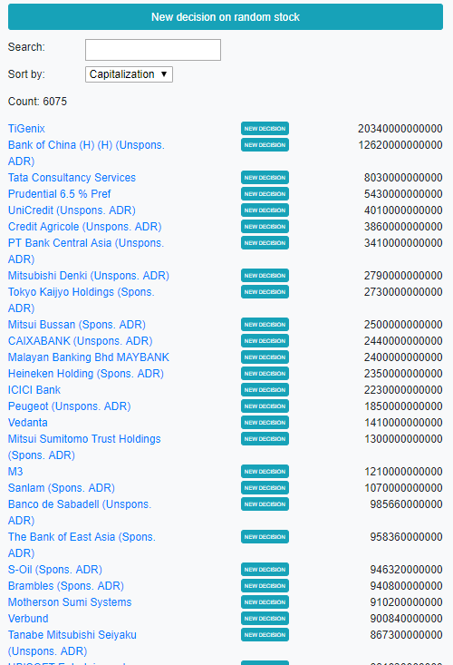
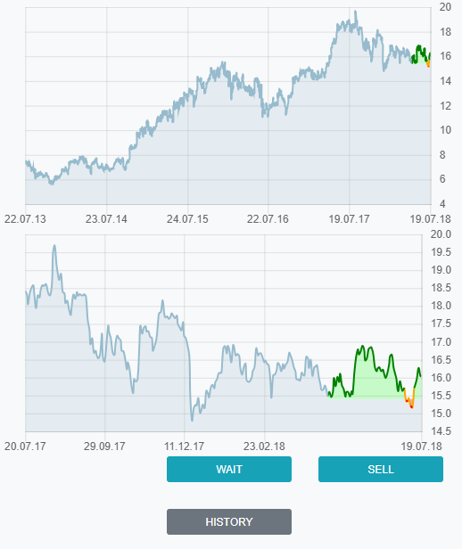
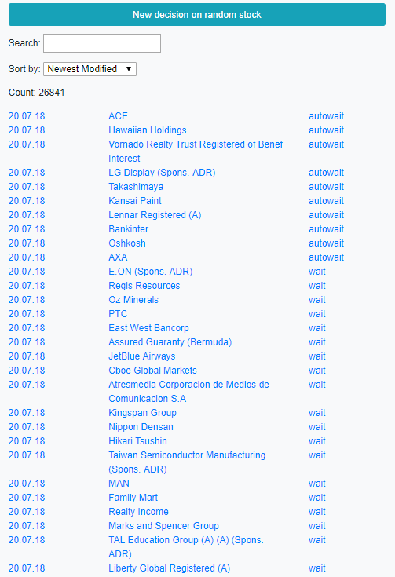
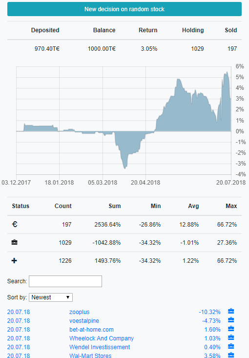

# N.A.Y.trading #
N.A.Y.trading is a machine learning application that mimics stock trading decisions of the user. 

The user's analysis philosophy must be purely technical, i.e. the only resource data for a buy/sell decision is the price history of the past 5 years. No stock name, no news, no ratings.

## :pencil: Recording the user's trade decisions ##
The website [NAYtrading](NAYtrading) presents a stock price chart to the user and lets him/her choose whether to buy, ignore, or sell the stock. The price history and the decision are stored in a database. 

**Try the official online version: [naytrading.com](http://naytrading.com)**

<details>
<summary>How to install</summary>

NAYtrading needs a custom stock data provider implementation. This repository includes an example plugin in [NAYtrading.Plugin](NAYtrading.Plugin) that can be used to quick start the development of such a provider.

```sh
# install tools
root@host:~$ apt-get install sudo
root@host:~$ apt-get install curl
root@host:~$ apt-get install git

# install nodejs
root@host:~$ curl -sL https://deb.nodesource.com/setup_8.x | bash
root@host:~$ apt-get install -y nodejs
root@host:~$ apt-get install -y build-essential
root@host:~$ npm i -g sequelize-cli
root@host:~$ npm i -g node-autostart

# install mysql
root@host:~$ apt-get install mysql-server
root@host:~$ mysql_secure_installation
root@host:~$ mysql -u root -p
[press enter on password prompt]
MariaDB [(none)]> create database naytrading;
MariaDB [(none)]> create user 'naytrading'@'localhost' identified by 'naytrading';
MariaDB [(none)]> grant all on naytrading.* to 'naytrading' identified by 'naytrading';
[Ctrl+C]

# install python 3.x
root@host:~$ apt-get install python3
root@host:~$ apt-get install python3-pip
root@host:~$ pip3 install --upgrade pip
root@host:~$ pip3 install argparse
root@host:~$ pip3 install datetime
root@host:~$ pip3 install noise
root@host:~$ pip3 install numpy

# redirect port 80 to 5000 and 443 to 5001 (or setup a reverse proxy)
root@host:~$ apt-get install iptables-persistent
root@host:~$ iptables -t nat -I PREROUTING -p tcp --dport 80 -j REDIRECT --to-port 5000
root@host:~$ iptables -t nat -I PREROUTING -p tcp --dport 443 -j REDIRECT --to-port 5001
root@host:~$ iptables-save > /etc/iptables/rules.v4

# create user
root@host:~$ adduser naytrading
[enter secure password]
[leave details empty]
root@host:~$ su naytrading
naytrading@host:/root$ cd ~

# setup naytrading
naytrading@host:~$ git clone https://github.com/chrwoizi/naytrading.git
naytrading@host:~$ cd naytrading
naytrading@host:~/naytrading$ cd NAYtrading
naytrading@host:~/naytrading/NAYtrading$ npm install
naytrading@host:~/naytrading/NAYtrading$ cd app/config
naytrading@host:~/naytrading/NAYtrading/app/config$ cp config.mandatory.json config.json
naytrading@host:~/naytrading/NAYtrading/app/config$ cp database.mandatory.json database.json
naytrading@host:~/naytrading/NAYtrading/app/config$ vi config.json
[set production.admin_user to your email address]
[set production.proxy if you access the web through a proxy]
[set production.python to your python executable, e.g. python3]
[set the instruments_providers and rates_providers to your custom implementation, e.g. "instruments_providers":{"e": "../../../NAYtrading.Plugin/providers/example/example_instruments_provider"}]
:wq
naytrading@host:~/naytrading/NAYtrading/app/config$ cd ../..
naytrading@host:~/naytrading/NAYtrading$ chmod +x dbmigrate.sh
naytrading@host:~/naytrading/NAYtrading$ chmod +x production.sh
naytrading@host:~/naytrading/NAYtrading$ chmod +x upgrade_production.sh
naytrading@host:~/naytrading/NAYtrading$ ./dbmigrate.sh

# run naytrading
naytrading@host:~/naytrading/NAYtrading$ autostart enable -n "naytrading" -p "/home/naytrading/naytrading/NAYtrading" -c "./production.sh"
naytrading@host:~/naytrading/NAYtrading$ ./production.sh &

# back to root
naytrading@host:~/naytrading/NAYtrading$ exit

# optional: activate HTTPS using letsencrypt.org

# if using Debian 8 (otherwise follow the instructions on https://certbot.eff.org)
root@host:~$ echo deb http://ftp.debian.org/debian jessie-backports main>/etc/apt/sources.list.d/jessie-backports.list
root@host:~$ apt-get update
root@host:~$ apt-get install certbot -t jessie-backports

# register with letsencrypt
root@host:~$ su naytrading
naytrading@host:~/naytrading/NAYtrading$ certbot certonly --config-dir=./letsencrypt/config --logs-dir=./letsencrypt/logs --work-dir=./letsencrypt/work-dir
[select the webroot method]
[enter your email address]
[read and agree to the terms of service]
[enter your domain name]
[select enter a new webroot]
[enter the web root /home/naytrading/naytrading/NAYtrading/static]

# link the certificate
naytrading@host:~/naytrading/NAYtrading$ ln -s ../letsencrypt/config/live/[YOUR DOMAIN]/privkey.pem ./keys/privkey.pem
naytrading@host:~/naytrading/NAYtrading$ ln -s ../letsencrypt/config/live/[YOUR DOMAIN]/cert.pem ./keys/cert.pem
naytrading@host:~/naytrading/NAYtrading$ ln -s ../letsencrypt/config/live/[YOUR DOMAIN]/chain.pem ./keys/chain.pem

# enable https
naytrading@host:~/naytrading/NAYtrading$ vi app/config/config.json
[add a new line] "https_enabled": true
:wq
naytrading@host:~/naytrading/NAYtrading$ killall production.sh
naytrading@host:~/naytrading/NAYtrading$ killall node
naytrading@host:~/naytrading/NAYtrading$ ./production.sh &
```
</details><p></p>

List of stocks:



Making a new decision:



List of all previous decisions:

 

Statistics about the portfolio:



## :telephone: Forwarding the simulated trades to a broker ##

The web application [NAYtrading.Trader](https://github.com/chrwoizi/naytrading-trader) can be used to actually buy or sell the stocks based on the recorded user decisions.

## :mortar_board: Training a Convolutional Neural Network on the recorded data ##

The web site periodically processes the recorded data using [NAYtrading.Data](NAYtrading.Data) and provides CSV file downloads which are optimized for a neural network.

With [NAYtrading.AI](https://github.com/chrwoizi/naytrading-ai), a convolutional neural network is trained on the processed data, using the price history as input and the user decision as desired output. 

## :moneybag: Using the trained network ##

With [NAYtrading.AI](https://github.com/chrwoizi/naytrading-ai), current stock prices are fed into the trained network periodically to find stocks that can be bought or sold based on the user's analysis pattern. The application acts as a user on [NAYtrading](NAYtrading), so the gains and losses can be evaluated by logging in on [NAYtrading](NAYtrading). Also, the trade decisions can be forwarded to a broker using [NAYtrading.Trader](https://github.com/chrwoizi/naytrading-trader), making N.A.Y.trading an **automated stock trading system**. 
