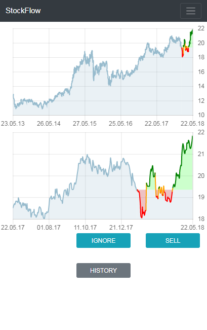

# StockFlow #
StockFlow is a machine learning application that mimics stock trading decisions of the user. 

The user's analysis philosophy must be purely technical, i.e. the only resource data for a buy/sell decision is the price history of the past 5 years. No stock name, no news, no ratings.

## :pencil: Recording the user's trade decisions ##
The website [StockFlow.Node](StockFlow.Node) presents a stock price chart to the user and lets him/her choose whether to buy, ignore, or sell the stock. The price history and the decision are stored in a database. 

**Try the official online version: [stockflow.net](http://stockflow.net)**

<details>
<summary>How to install</summary>

StockFlow.Node needs a stock data provider to work as expected. This repository includes an example plugin in [StockFlow.Node.Providers](StockFlow.Node.Providers) that can be used to quick start the development of such a provider.

```sh
# install tools
root@host:~$ apt-get install sudo
root@host:~$ apt-get install curl
root@host:~$ apt-get install git

# install nodejs
root@host:~$ curl -sL https://deb.nodesource.com/setup_8.x | bash
root@host:~$ apt-get install -y nodejs
root@host:~$ apt-get install -y build-essential
root@host:~$ npm i -g sequelize-cli
root@host:~$ npm i -g node-autostart

# install mysql
root@host:~$ apt-get install mysql-server
root@host:~$ mysql_secure_installation
root@host:~$ mysql -u root -p
[press enter on password prompt]
MariaDB [(none)]> create database stockflow;
MariaDB [(none)]> create user 'stockflow'@'localhost' identified by 'stockflow';
MariaDB [(none)]> grant all on stockflow.* to 'stockflow' identified by 'stockflow';
[Ctrl+C]

# install python 3.x
root@host:~$ apt-get install python3
root@host:~$ apt-get install python3-pip
root@host:~$ pip3 install --upgrade pip
root@host:~$ pip3 install argparse
root@host:~$ pip3 install datetime
root@host:~$ pip3 install noise
root@host:~$ pip3 install numpy

# redirect port 80 to 5000 (or setup a reverse proxy)
root@host:~$ apt-get install iptables-persistent
root@host:~$ iptables -t nat -I PREROUTING -p tcp --dport 80 -j REDIRECT --to-port 5000
root@host:~$ iptables-save > /etc/iptables/rules.v4

# create user
root@host:~$ adduser stockflow
[enter secure password]
[leave details empty]
stockflow@host:~$ su stockflow
stockflow@host:/root$ cd ~

# setup stockflow
stockflow@host:~$ git clone https://github.com/chrwoizi/stockflow.git
stockflow@host:~$ cd stockflow
stockflow@host:~/stockflow$ cd StockFlow.Node
stockflow@host:~/stockflow/StockFlow.Node$ npm install
stockflow@host:~/stockflow/StockFlow.Node$ cd app/config
stockflow@host:~/stockflow/StockFlow.Node/app/config$ cp config.mandatory.json config.json
stockflow@host:~/stockflow/StockFlow.Node/app/config$ cp database.mandatory.json database.json
stockflow@host:~/stockflow/StockFlow.Node/app/config$ vi config.json
[set production.export_token to a secret value of your choice]
[set production.import_token to a secret value of your choice]
[set production.admin_user to your email address]
[set production.proxy if you access the web through a proxy]
[set python to your python executable, e.g. python3]
[add your custom stock data provider envconfig to the include array, e.g. "../../../StockFlow.Node.Providers/config/envconfig"]
:wq
stockflow@host:~/stockflow/StockFlow.Node/app/config$ cd ../..
stockflow@host:~/stockflow/StockFlow.Node$ chmod +x dbmigrate.sh
stockflow@host:~/stockflow/StockFlow.Node$ chmod +x production.sh
stockflow@host:~/stockflow/StockFlow.Node$ chmod +x upgrade_production.sh
stockflow@host:~/stockflow/StockFlow.Node$ ./dbmigrate.sh

# run stockflow
stockflow@host:~/stockflow/StockFlow.Node$ autostart enable -n "stockflow" -p "/home/stockflow/stockflow/StockFlow.Node" -c "./production.sh"
stockflow@host:~/stockflow/StockFlow.Node$ ./production.sh &
```
</details><p></p>

 

 

## :telephone: Forwarding the simulated trades to a broker ##

The console application [StockFlow.Trader](StockFlow.Trader) can be used to actually buy or sell the stocks based on the recorded user decisions.

## :mortar_board: Training a Convolutional Neural Network on the recorded data ##

The web site periodically processes the recorded data using [StockFlow.Data](StockFlow.Data) and provides CSV file downloads which are optimized for a neural network.

With [main.py](StockFlow.AI/main.py), a convolutional neural network is trained on the processed data, using the price history as input and the user decision as desired output.

With [synth.py](StockFlow.AI/synth.py), synthetical data can be generated to pre-train the network, potentially increasing accuracy on a small real-world training set.

## :moneybag: Using the trained network ##

With [client.py](StockFlow.AI/client.py), current stock prices are fed into the trained network periodically to find stocks that can be bought or sold based on the user's analysis pattern. The application acts as a user on [StockFlow.Node](StockFlow.Node), so the gains and losses can be evaluated by logging in on [StockFlow.Node](StockFlow.Node) using the same account as [client.py](StockFlow.AI/client.py). Also, the trade decisions can be forwarded to a broker using [StockFlow.Trader](StockFlow.Trader), making StockFlow an **automated stock trading system**.
