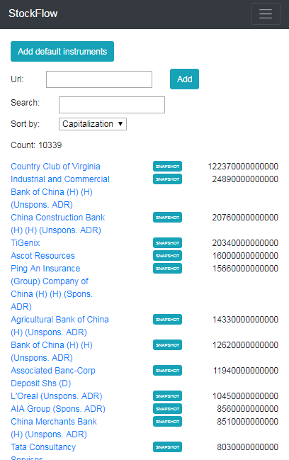
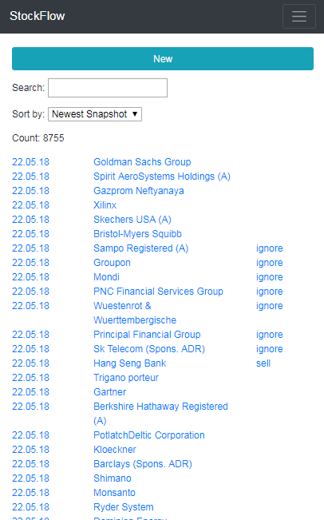

# StockFlow #
StockFlow is a machine learning application that mimics stock trading decisions of the user. 

The user's analysis philosophy must be purely technical, i.e. the only resource data for a buy/sell decision is the price history of the past 5 years. No stock name, no news, no ratings.

## :pencil: Recording the user's trade decisions ##
The website [StockFlow.Web](StockFlow.Web) presents a stock price chart to the user and lets him/her choose whether to buy, ignore, or sell the stock. The price history and the decision are stored in a database. 

 

 

## :telephone: Forwarding the simulated trades to a broker ##

The console application [StockFlow.Trader](StockFlow.Trader) can be used to actually buy or sell the stocks based on the recorded user decisions.

## :mortar_board: Training a Convolutional Neural Network on the recorded data ##

The WPF application [StockFlow.WPF](StockFlow.WPF) can be used to export and pre-process the recorded data before feeding it into a neural network.

With [main.py](StockFlow.Python/main.py), a convolutional neural network is trained on the recorded data, using the price history as input and the user decision as desired output.

With [synth.py](StockFlow.Python/synth.py), synthetical data can be generated to pre-train the network, potentially increasing accuracy on a small real-world training set.

## :moneybag: Using the trained network ##

With [client.py](StockFlow.Python/client.py), current stock prices are fed into the trained network periodically to find stocks that can be bought or sold based on the user's analysis pattern. The application acts as a user on [StockFlow.Web](StockFlow.Web), so the gains and losses can be evaluated by logging in on [StockFlow.Web](StockFlow.Web) using the same account as [client.py](StockFlow.Python/client.py). Also, the trade decisions can be forwarded to a broker using [StockFlow.Trader](StockFlow.Trader), making StockFlow an **automated stock trading system**.
